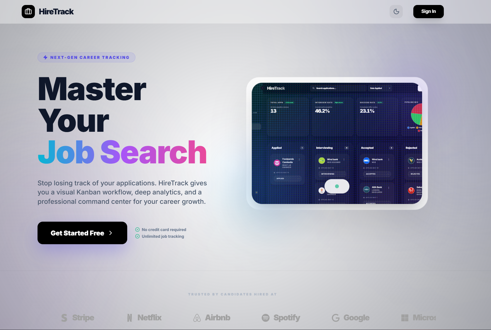
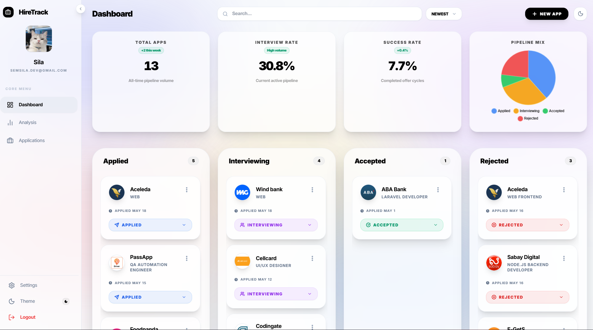
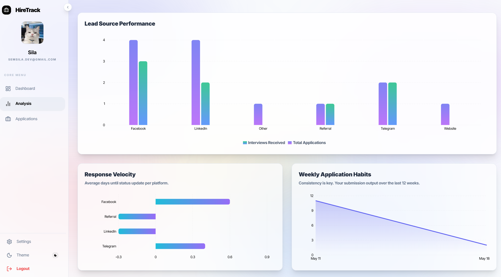

# hiretrackinging

hiretrackinging is a sleek, personal job application tracker designed to help job seekers organize their career search. Track your applications, manage statuses, and visualize your progress with a modern, high-performance interface.

This project is a decoupled application featuring a **Laravel 12** backend API and a **React 19** frontend powered by **Vite**.

## 📸 Screenshots

### Landing Page


### Dashboard


### Analytics


## ✨ Features

- **Personal Dashboard & Kanban Board:** A centralized view of all your job applications with real-time search, sorting, and a drag-and-drop Kanban board for visual status management.
- **Advanced Analytics:** Quick stats, application velocity metrics, and source tracking (e.g., LinkedIn, Indeed) to help you understand your application funnel.
- **Profile Management:** User profile settings with avatar support.
- **Status Management:** Seamlessly move applications through stages: *Applied*, *Interviewing*, *Accepted*, or *Rejected*.
- **Secure Authentication:** User accounts and session management powered by **Laravel Sanctum**.
- **Modern UI/UX:** A responsive, glassmorphic interface built with **Tailwind CSS**, featuring smooth transitions and interactive feedback.
- **Rich Application Data:** Support for tracking company logos via external URLs and tracking application sources.

## 🛠️ Tech Stack

### Backend
- **Framework:** Laravel 12
- **Auth:** Laravel Sanctum (Stateful API Authentication)
- **Database:** MySQL 
- **Testing:** PHPUnit

### Frontend
- **Framework:** React 19
- **Build Tool:** Vite
- **Styling:** Tailwind CSS
- **HTTP Client:** Axios
- **Icons:** Custom SVG & Lucide-inspired icons

## 📂 Project Structure

```text
hiretrackinging/
├── backend/               # Laravel 12 API
│   ├── app/               # Application logic (Controllers, Models)
│   ├── database/          # Migrations, Factories, Seeders
│   ├── routes/            # API routing (api.php)
│   └── tests/             # PHPUnit tests
└── frontend/              # React 19 SPA
    ├── public/            # Static assets
    └── src/
        ├── components/    # Reusable UI components (Kanban, Analytics, etc.)
        ├── pages/         # Route views (Dashboard, Analysis, Profile, Auth)
        └── utils/         # Helper functions
```

## 🚀 Getting Started

### Prerequisites

- PHP 8.2+
- Composer
- **Secure Authentication:** User accounts and session management powered by **Laravel Sanctum** with support for **Google One-Tap / OAuth**.

...

### Backend Setup

1. **Navigate to the backend directory:**
   ```bash
   cd backend
   ```
2. **Install dependencies:**
   ```bash
   composer install
   ```
3. **Configure environment:**
   ```bash
   cp .env.example .env
   php artisan key:generate
   ```
4. **Google Auth Configuration:**
   Add your Google credentials to `.env`:
   ```env
   GOOGLE_CLIENT_ID=your_id.apps.googleusercontent.com
   GOOGLE_CLIENT_SECRET=your_secret
   ```
5. **Database Configuration:**
   Ensure your `.env` is configured for your database. For a quick start with SQLite:
   ```env
   DB_CONNECTION=sqlite
   ```
6. **Run Migrations:**
   ```bash
   php artisan migrate
   ```
7. **Start the API server:**
   ```bash
   php artisan serve
   ```

### Frontend Setup

1. **Navigate to the frontend directory:**
   ```bash
   cd frontend
   ```
2. **Install dependencies:**
   ```bash
   npm install
   ```
3. **Configure environment:**
   Create a `.env` file (or copy `.env.example` if available) and point to your backend:
   ```env
   VITE_API_BASE_URL=http://localhost:8000/api
   ```
4. **Google Auth setup:**
   Open `src/main.jsx` and replace the `clientId` with your Google Client ID.
5. **Start the development server:**
   ```bash
   npm run dev
   ```
## 📄 License

hiretrackinging is open-sourced software licensed under the [MIT license](LICENSE).
